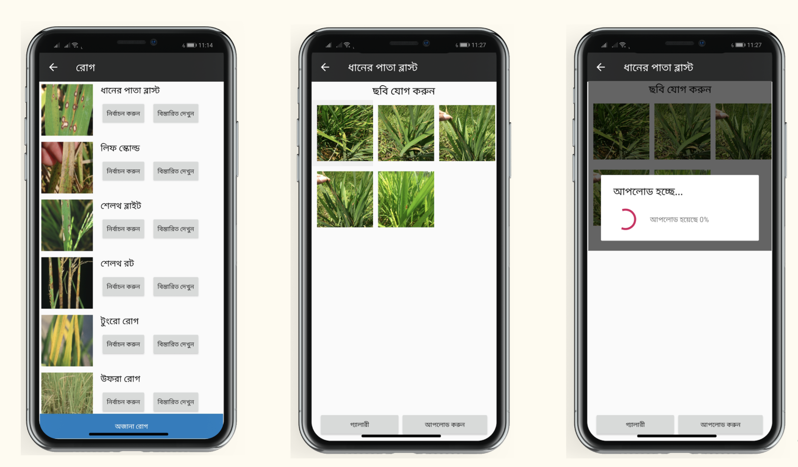
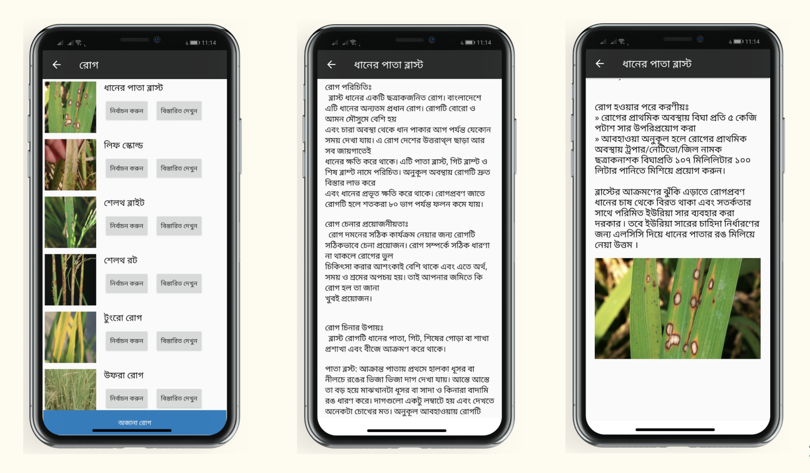
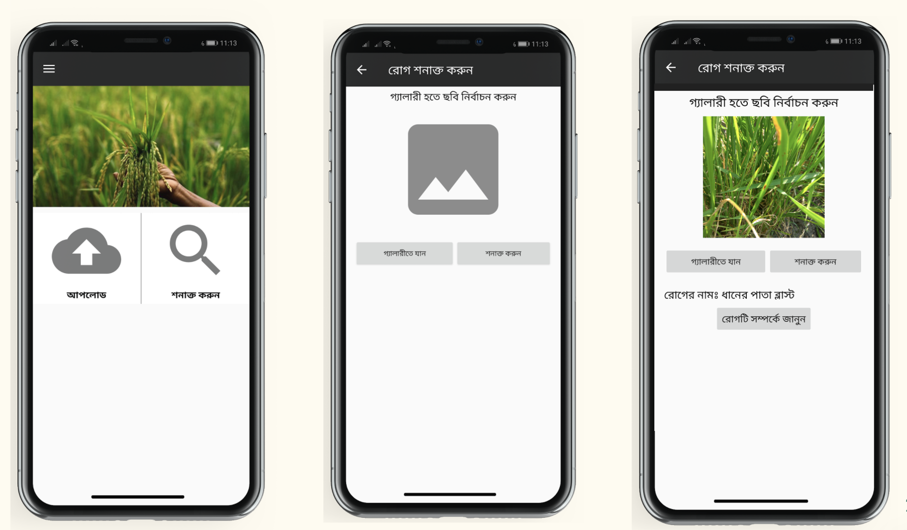

# DhanOushodhi - ধান ঔষধি
This was our final year project. This application is for showing output of our Rice disease ditection ML model.

Minimum version required to run: Android 6

## Team members

* **[Ummea Sarah Ali](linkedin.com/in/sarah-twinkle-53520b191)**
* **[Laila Sultana](https://www.linkedin.com/in/laila-sultana-1915a9197/)**
* **[Abdullah Al Noman]()**
* **[Tashin Ahmed](https://tashinahmed.github.io/)**
* **[Md. Faysal Mahmud Abid](https://fmabid.github.io/)**

## About the ML Model and Experiment
We have used **Faster R CNN** for identifying significant portion  and **CNN** for disease detection.

### *Results*

### *App view*

